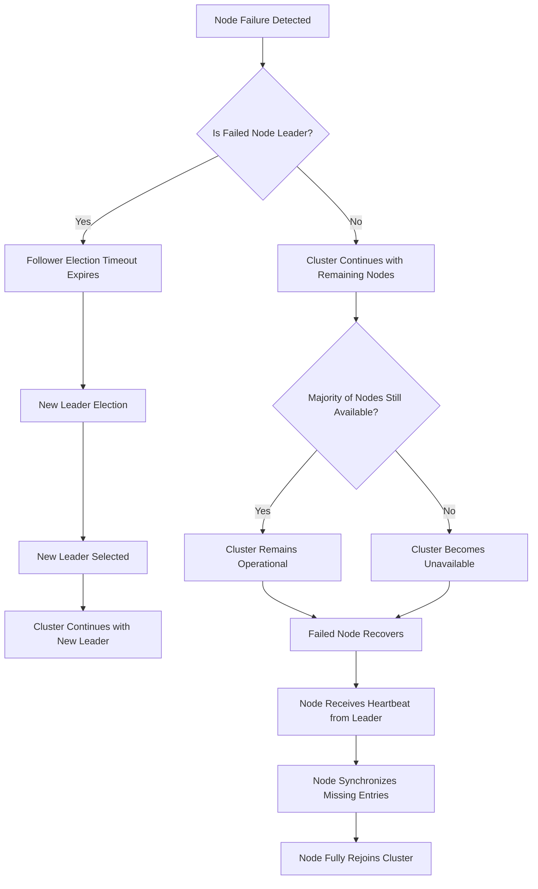
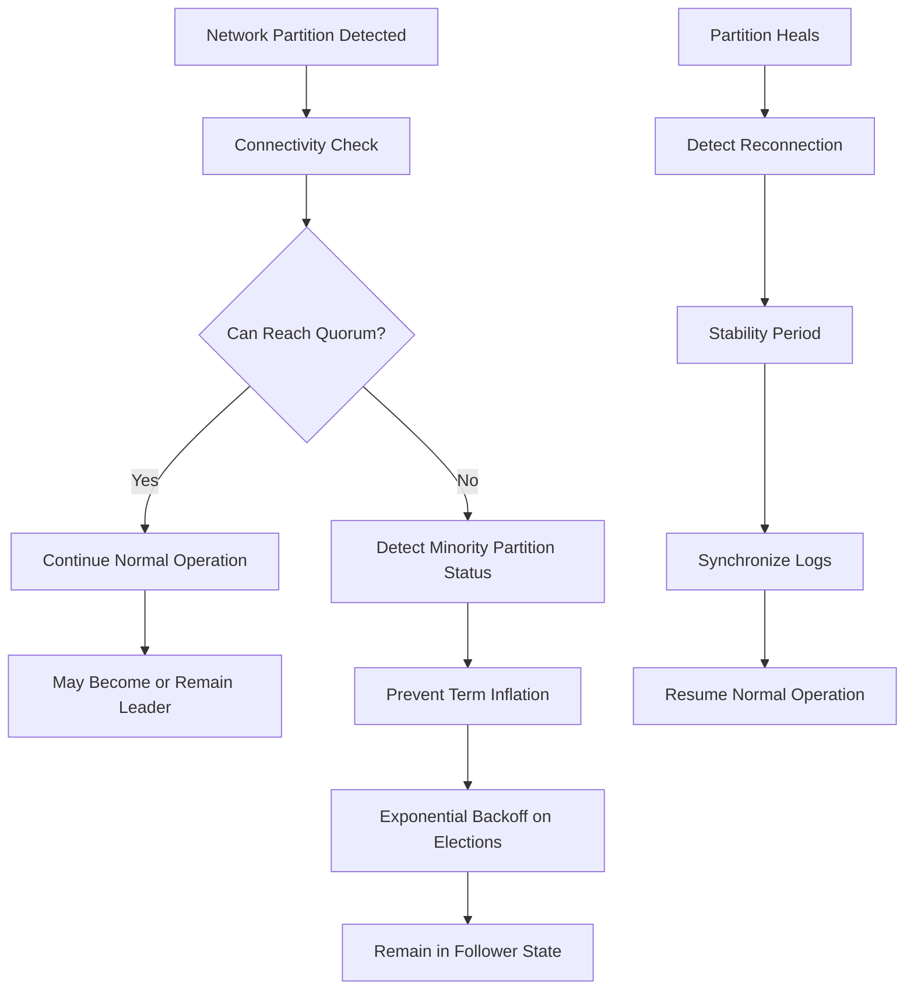
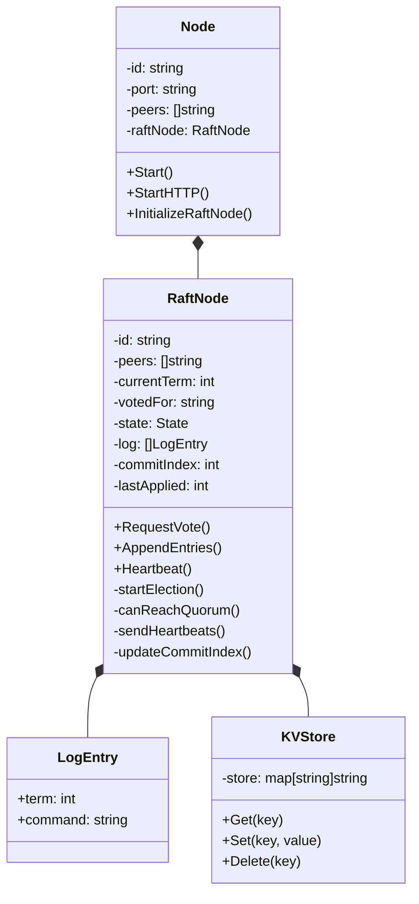
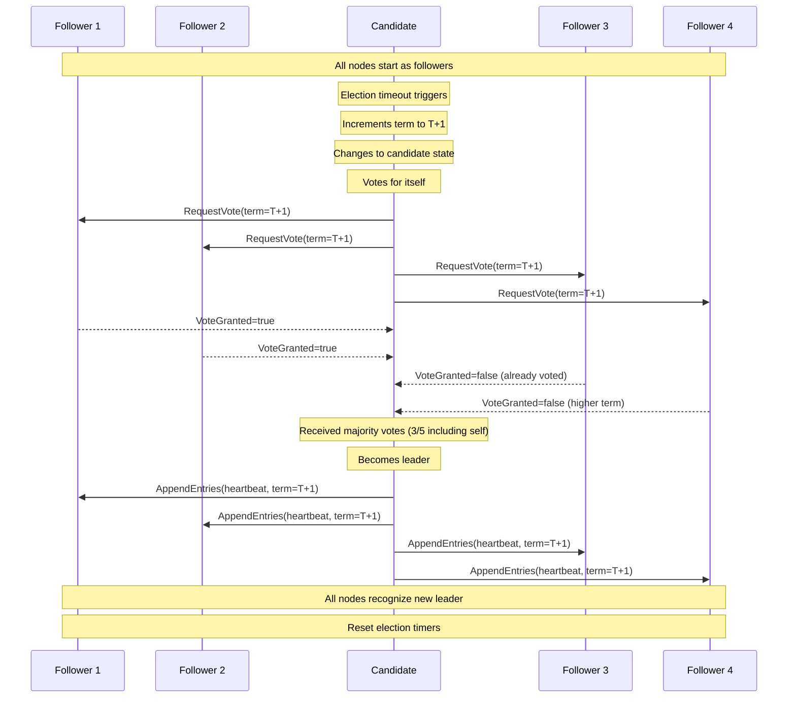
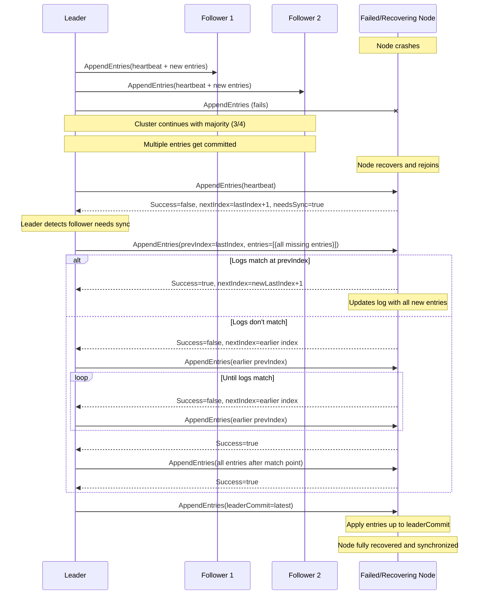
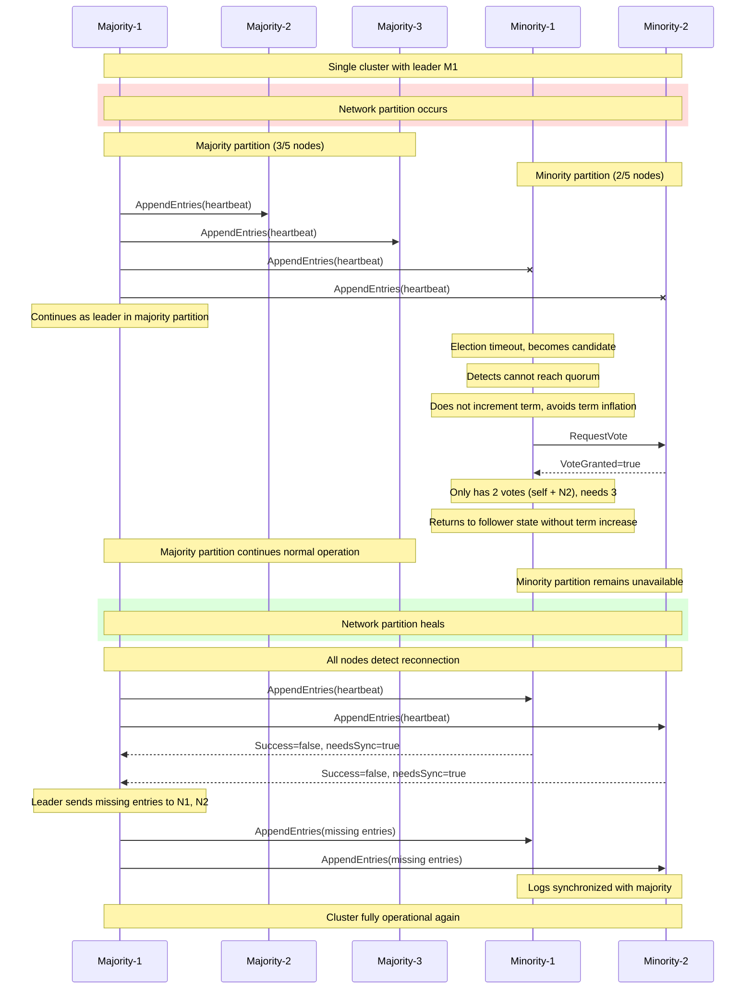

# Raft-on-the-Go

A robust implementation of the [Raft consensus algorithm](https://raft.github.io/) in Go using gRPC for communication between nodes.

## Table of Contents

- [Overview](#overview)
- [Features](#features)
- [Getting Started](#getting-started)
- [Usage](#usage)
  - [Managing the Cluster](#managing-the-cluster)
  - [Simulating Network Conditions](#simulating-network-conditions)
  - [Interacting with the Cluster](#interacting-with-the-cluster)
- [Core RAFT Workflows](#core-raft-workflows)
  - [Leader Election](#leader-election)
  - [Log Replication](#log-replication)
  - [Node Recovery](#node-recovery)
  - [Network Partitioning](#network-partitioning)
- [API Reference](#api-reference)
- [Fault Tolerance](#fault-tolerance)
- [Implementation Details](#implementation-details)

## Overview

Raft-on-the-Go is a distributed consensus implementation that provides a consistent, fault-tolerant key-value store across multiple nodes. It follows the Raft protocol for leader election, log replication, and handling network partitions.

This implementation focuses on robustness and fault tolerance, with special attention to handling network partitions gracefully. The system ensures that when network issues occur, the cluster maintains consistency while preventing term inflation in minority partitions, and smoothly recovers when connectivity is restored.

## Features

- **Consensus Protocol**: Complete implementation of the Raft consensus algorithm
- **Leadership Management**
  - Leader election with term-based voting
  - Automatic leader step-down when disconnected from majority
  - No-op entries for establishing leadership
  - Protection against multiple leaders in the same term
- **Data Consistency**
  - Log replication with strong consistency guarantees
  - Majority-based commit rules to ensure safety
  - Efficient log reconciliation for lagging nodes
- **Fault Tolerance**
  - Automatic recovery of failed nodes
  - Continued operation with minority node failures
  - Graceful leader failover
- **Network Partition Handling**
  - Specialized minority partition detection
  - Prevention of term inflation in minority partitions
  - Smooth reconnection handling after partition healing
  - Leadership stability during network fluctuations
- **Operational Features**
  - HTTP API for cluster management and inspection
  - Docker-based network partition testing environment
  - Comprehensive logging for debugging and monitoring
  - Graceful node shutdown and recovery

## Getting Started

### Prerequisites

- Go 1.16+
- Protocol Buffers compiler (`protoc`)
- tmux (for local multi-node testing)
- Docker and Docker Compose (for containerized testing and network partitioning)

### Installation

1. Clone the repository:

   ```sh
   git clone https://github.com/yourusername/raft-on-the-go.git
   cd raft-on-the-go
   ```

2. Install Go dependencies:

   ```sh
   go mod download
   ```

3. Generate protocol buffer code:

   ```sh
   protoc --go_out=. --go-grpc_out=. ./proto/raft.proto
   ```

4. Make scripts executable:

   ```sh
   chmod +x ./script/*.sh
   ```

5. Build the project:
   ```sh
   go build
   ```

### Project Structure

```
raft-on-the-go/
├── proto/             # Protocol buffer definitions
├── script/            # Cluster management and testing scripts
├── server/            # GRPC server and node implementation
├── utils/             # Core Raft algorithm implementation
│   ├── kvstore.go     # Key-value store (state machine)
│   └── raft.go        # Raft consensus logic
├── main.go            # Entry point for both server and client
├── go.mod             # Go module definition
└── docker-compose.yml # Docker configuration for cluster testing
```

## Usage

### Managing the Cluster

**Start a single node**

```sh
go run main.go
```

**Launch a 5-node cluster using tmux**

```sh
./script/start-raft-network.sh
```

This creates a cluster of 5 nodes running on ports 5001-5005 (gRPC) and 6001-6005 (HTTP).

**Shutdown the cluster**

```sh
./script/kill-raft-network.sh
```

**Create a client to interact with the leader**

```sh
go run main.go --client --leader=<leader-port|5001> --term=<leader-term|1>
```

### Simulating Network Conditions

#### Using Docker (Recommended)

**Start the Docker-based Raft cluster**

```sh
./script/docker-start-raft-network.sh
```

**Create a network partition between node groups**

```sh
./script/docker-create-partition.sh '1,2:3,4,5'
```

This creates a network partition between:

- Group 1: Nodes 1 and 2 (minority)
- Group 2: Nodes 3, 4, and 5 (majority)

Expected behavior:

- The majority partition (3,4,5) will maintain or elect a stable leader
- The minority partition (1,2) will detect it cannot reach a quorum
- Nodes in the minority partition will not inflate their terms
- The system will remain partially available (through the majority partition)

Other partition examples:

```sh
# Isolate node 1 from all other nodes
./script/docker-create-partition.sh '1:2,3,4,5'

# Split the cluster into two equal groups
./script/docker-create-partition.sh '1,2,3:4,5'
```

**Debug network connections**

```sh
./script/docker-network-debug.sh
```

This will show the current partition status and connectivity between nodes.

**Restore network connectivity**

```sh
./script/docker-restore-connections.sh
```

After restoring connections, the system will:

1. Detect the reconnection event
2. Maintain the existing leader from the majority partition
3. Synchronize logs from the leader to nodes in the minority partition
4. Prevent unnecessary leader elections and term inflation
5. Restore full cluster functionality without disruption

**Stop the Docker-based Raft cluster**

```sh
./script/docker-kill-raft-network.sh
```

#### Using Local Setup (Legacy)

**Create a network partition** (requires sudo)

```sh
sudo ./script/network-partition.sh create
```

This creates two partitions:

- Partition 1: Nodes on ports 5001, 5002, 5003
- Partition 2: Nodes on ports 5004, 5005

**Restore network connectivity**

```sh
sudo ./script/network-partition.sh remove
```

### Interacting with the Cluster

**Inspect node state**

```sh
curl localhost:<http-port>/inspect | jq
```

> Note: HTTP port = gRPC port + 1000 (e.g., gRPC port 5001 → HTTP port 6001)

**Add an entry to the distributed log** (must be sent to leader)

```sh
curl -X POST http://localhost:6001/append -H "Content-Type: application/json" -d '{
  "entries": [
    {
      "command": "key1=value1"
    }
  ]
}'
```

**Response format**

```json
{
  "term": 1,
  "success": true,
  "nextIndex": 2
}
```

**Trigger node shutdown** (gracefully stops a node)

```sh
curl -X POST http://localhost:6001/shutdown
```

## API Reference

### HTTP Endpoints

| Endpoint    | Method | Description                            |
| ----------- | ------ | -------------------------------------- |
| `/inspect`  | GET    | Returns the current state of the node  |
| `/append`   | POST   | Appends entries to the distributed log |
| `/shutdown` | POST   | Gracefully shuts down the node         |

### Inspect Response Example

```json
{
  "node_id": "node1",
  "current_term": 2,
  "state": "Leader",
  "log_entries": [
    {
      "index": 1,
      "term": 1,
      "command": "key1=value1"
    }
  ],
  "commit_index": 1,
  "last_applied": 1,
  "kv_store": {
    "key1": "value1"
  }
}
```

## Fault Tolerance

The implementation includes robust error handling for various failure scenarios, ensuring reliable operation even in challenging distributed environments.

### Node Failures

When a node fails, the system automatically adapts:



Key resilience features:

- The cluster continues operating as long as a majority of nodes remain active
- Leader failures trigger automatic re-elections
- When nodes recover, they automatically catch up with missed operations
- No manual intervention required for basic failure recovery

### Network Partitions

Network partitions are handled with special care to maintain consistency:



Advanced partition handling features:

1. **Partition Detection**

   - Nodes continuously monitor their connectivity to the cluster
   - Adaptive quorum checking determines partition status
   - Special handling for nodes in minority partitions

2. **Term Stability**

   - Minority partitions avoid term inflation through term increment prevention
   - Term rollback mechanisms prevent term wars after reconnection
   - Leadership stability is prioritized during healing periods

3. **Reconnection Management**
   - Automatic detection of network healing
   - Post-reconnection stability period prevents unnecessary leadership changes
   - Progressive log synchronization restores consistency across all nodes

## Implementation Details

This implementation extends the standard Raft consensus algorithm with enhancements for improved stability and partition tolerance.

### Core Components and Design



### Key Implementation Features

- **State Management**:

  - Each node maintains one of three states: Follower, Candidate, or Leader
  - State transitions are triggered by timeouts, elections, and higher term discoveries
  - Thread-safe state management with mutex protection

- **Log Consistency**:

  - All operations go through the leader to ensure linearizability
  - Entries are committed only after replication to a majority
  - Log consistency check enforced with prevLogIndex and prevLogTerm
  - Automatic log conflict resolution with backward search algorithm

- **Election Process**:

  - Randomized election timeouts prevent simultaneous elections
  - Pre-vote phase with quorum checking avoids unnecessary elections
  - Exponential backoff on failed elections reduces network contention
  - Connectivity checking prevents minority partitions from attempting elections

- **Partition Tolerance Enhancements**:

  - Term increment prevention in detected minority partitions
  - Network reconnection detection with connectivity change monitoring
  - Post-reconnection stability period with longer timeouts
  - Smooth leadership transition when partitions heal

- **Initialization Coordination**:

  - Nodes start in an uninitialized state without election timers
  - After all nodes are up, a coordinated initialization happens
  - This prevents premature elections and ensures clean startup

- **Leader Stability**:
  - No-op entries added when nodes become leaders
  - All followers reset election timers on valid heartbeats
  - Leaders step down when they can't reach quorum
  - LeaderStabilityTimeout prevents election churn

The system is designed to be resilient to common distributed system failures, including partitions, node failures, and message loss, while maintaining performance and consistency.

### Code Organization

- **utils/raft.go**: Core consensus logic and Raft algorithm implementation
- **utils/kvstore.go**: State machine implementation as a key-value store
- **server/server.go**: gRPC and HTTP API interfaces
- **proto/raft.proto**: Protocol buffer definitions for inter-node communication
- **script/**: Shell scripts for cluster management and network partition testing
- **main.go**: Application entry point for both server and client modes

## Core Raft Workflows

### Leader Election

The leader election process ensures that only one leader exists at a time and that a leader has the support of a majority of nodes (a quorum).



Key aspects of the leader election:

1. Nodes start in follower state with randomly set election timers
2. When a follower's timer expires without hearing from a leader, it becomes a candidate
3. Candidates increment their term, vote for themselves, and request votes from other nodes
4. If a candidate receives votes from a majority of nodes, it becomes the leader
5. Leaders send regular heartbeats to maintain authority and prevent new elections
6. If a candidate sees a higher term, it reverts to follower state

### Log Replication

Log replication ensures all nodes eventually contain the same log entries in the same order, guaranteeing consistency across the distributed system.

```mermaid
sequenceDiagram
    participant C as Client
    participant L as Leader
    participant F1 as Follower 1
    participant F2 as Follower 2
    participant F3 as Follower 3

    C ->> L: Write(key1=value1)
    Note over L: Appends to local log
    Note over L: term=T, index=N

    par Leader to Followers
        L ->> F1: AppendEntries(prevIndex=N-1, entries=[{term=T, key1=value1}])
        L ->> F2: AppendEntries(prevIndex=N-1, entries=[{term=T, key1=value1}])
        L ->> F3: AppendEntries(prevIndex=N-1, entries=[{term=T, key1=value1}])
    end

    F1 -->> L: Success=true
    F2 -->> L: Success=true
    F3 -->> L: Success=false (log inconsistency)

    Note over L: Entry replicated to majority (2/3 followers + leader)
    Note over L: Updates commitIndex=N

    L ->> F1: AppendEntries(leaderCommit=N)
    L ->> F2: AppendEntries(leaderCommit=N)
    L ->> F3: AppendEntries(prevIndex=N-2, entries=[...])

    Note over L: Applies entry to state machine
    Note over F1,F2: Apply entry to state machines

    F3 -->> L: Success=true
    L ->> F3: AppendEntries(leaderCommit=N)
    Note over F3: Apply entry to state machine

    C <-- L: Success
```

Key aspects of log replication:

1. Clients send writes to the leader
2. Leader appends the entry to its log and replicates to followers
3. When a majority of nodes confirm replication, the entry is committed
4. Leader notifies followers of new commit index
5. Each node applies committed entries to its state machine (KV store)
6. Log inconsistencies are resolved by working backward until logs match

### Node Recovery

When a node fails and then recovers, it needs to catch up with the cluster state.



Key aspects of node recovery:

1. When a node rejoins, it receives heartbeats from the leader
2. The leader detects the node is behind through the lastLogIndex comparison
3. The leader sends all missing entries to bring the follower up to date
4. If logs are inconsistent, the leader and follower work backward until finding a matching entry
5. After synchronizing logs, the follower applies all committed entries
6. The node returns to full participation in the cluster

### Network Partitioning

Network partitions can split the cluster into isolated groups. Raft maintains consistency by only allowing the majority partition to make progress.



Key aspects of network partition handling:

1. When a partition occurs, only the majority partition can make progress
2. Nodes in minority partitions detect they cannot reach quorum
3. Minority nodes avoid term inflation by not incrementing terms when they cannot reach quorum
4. When the partition heals, nodes detect reconnection
5. The established leader from the majority partition continues leadership
6. Disconnected nodes synchronize their logs with the leader
7. The system ensures stability through reconnection-aware logic
